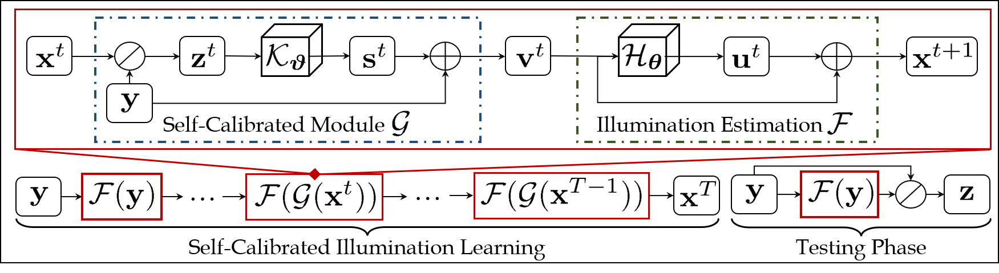
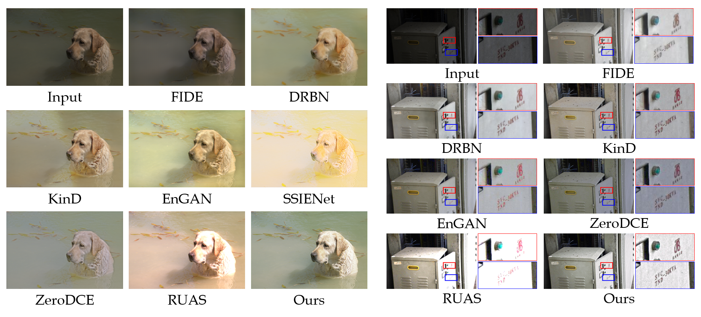
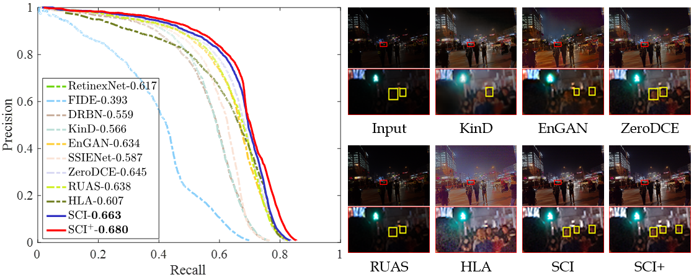
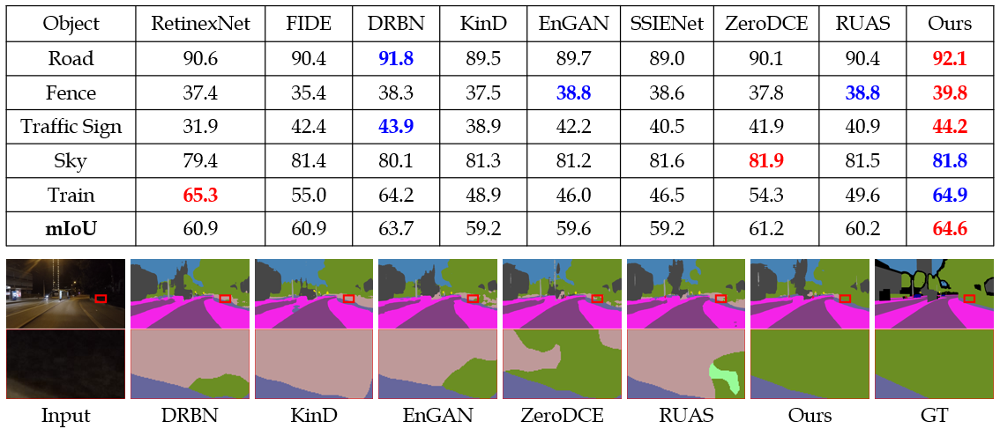

# Toward Fast, Flexible, and Robust Low-Light Image Enhancement, CVPR 2022 (Oral)
 

[[Paper](https://openaccess.thecvf.com/content/CVPR2022/html/Ma_Toward_Fast_Flexible_and_Robust_Low-Light_Image_Enhancement_CVPR_2022_paper.html)] [[Supplement Material](https://openaccess.thecvf.com/content/CVPR2022/supplemental/Ma_Toward_Fast_Flexible_CVPR_2022_supplemental.pdf)] [[Online Demo](https://replicate.com/vis-opt-group/SCI)] [[Media Report (in Chinese)](https://mp.weixin.qq.com/s/sac_TOQA16rvpArNYEa7yA)]


 
<p style="text-align:justify">Comparison among recent state-of-the-art methods and our method. KinD is a representative paired supervised method.  EnGAN considers the unpaired supervised learning. ZeroDCE [7] and RUAS [16] introduce unsupervised learning. Our method (just contains three convolutions with the size of 3 × 3) also belongs to unsupervised learning. As shown in the zoomed-in regions, these compared methods appear incorrect exposure, color distortion, and insufficient structure to degrade visual quality. In contrast, our result presents a vivid color and sharp outline. Further, we report the computational efficiency (SIZE, FLOPs, and TIME) in (b) and numerical scores for five types of measurement metrics among three tasks including enhancement (PSNR, SSIM, and EME), detection (mAP), and segmentation (mIoU) in (c), it can be easily observed that our method is remarkably superior to others.

## Self-Calibrated Illumination (SCI) Learning Framework
 
<p style="text-align:justify">The entire framework of SCI. In the training phase, our SCI is composed of the illumination estimation and self-calibrated module. The self-calibrated module map is added to the original low-light input as the input of the illumination estimation at the next stage. Note that these two modules are respectively shared parameters in the whole training procedure. In the testing phase, we just utilize a single illumination estimation module.</p>

## Codes
### Requirements
* python3.7
* pytorch==1.8.0
* cuda11.1
### Dataset used in the paper


[[MIT](https://drive.google.com/file/d/1KKB0ruBN12-vr-4upz8ZXKTsE3yHnt2V/view?usp=sharing)]: This paper randomly selected 500 image pairs and 100 image pairs from the MIT dataset for training and testing, respetively. Details about the RAW2RGB conversion process and the complete MIT dataset information could be obtained from [the official website](https://data.csail.mit.edu/graphics/fivek/).

[[LSRW](https://drive.google.com/file/d/1feX1yZwRtKv3kJwpGyBT1CtOjH9rrTg2/view?usp=sharing)]: This paper randomly selected 500 image pairs and 50 image pairs from the LSRW dataset for training and testing, respetively. The complete LSRW dataset information could be obtained from [the official website](https://drive.google.com/file/d/1X1uuH5gqmGua2AnN4BsC8YI-H7mJ1Dji/view?usp=sharing).

Note that the provided model in this code are not the model for generating results reported in the paper.
### Introduce the trained model
Under the weights folder, there are three different models. Note that, unlike the results presented in the paper, these three models were trained on low-light scenes of three different levels of difficulty (i.e. easy, medium and difficult). The difficulty level of low-light scenes is subjectively classified by our researchers. The proposed models trained on low-light scenes of different difficulty aim to make the method proposed in this paper better serve more general scenes. (If you want to reproduce the results shown in the paper, you could retrain the model following the configuration provided in the previous section.)

The training configurations of the above three models are as follows:
* easy.pt mainly uses the MIT dataset for training
* medium.pt mainly uses the LOL and LSRW datasets for training
* difficult.pt mainly uses the DARKFACE dataset for training

If you want to retrain a new model, you could write the path of the dataset to "train.py" and run "train.py", the final model will be saved to the weights folder, and the intermediate visualization results will be saved to the results folder.

In addition, we also provide "finetune.py" in the code root directory, which aims to make the method proposed in this paper better applicable to more variable scenarios. Specifically, if you are not satisfied with the performance of the three models provided above in some other low-light scenes, you could use "finetune.py" to fine-tune the models to get a model whose performance is satisfactory to you.

### Testing
* Prepare the data and put it in the specified folder
* Choose a specific model as needed (difficult.pt, medium.pt or easy.pt)
* Run "test.py"

## Results on Low-light Image Enhancement
 
 

## Results on High-level Vision Tasks
### Dark Face Detection
 

### Nighttime Semantic Segmentation
 


## Citation
```bibtex
@inproceedings{ma2022toward,
  title={Toward Fast, Flexible, and Robust Low-Light Image Enhancement},
  author={Ma, Long and Ma, Tengyu and Liu, Risheng and Fan, Xin and Luo, Zhongxuan},
  booktitle={Proceedings of the IEEE/CVF Conference on Computer Vision and Pattern Recognition},
  pages={5637--5646},
  year={2022}
}
```
